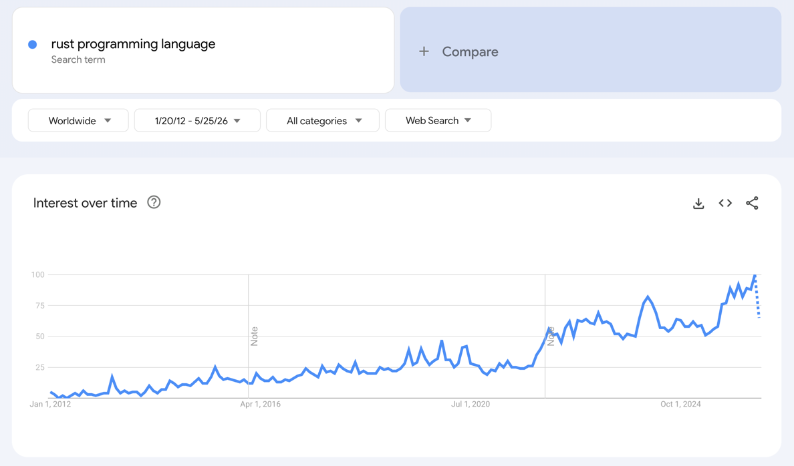
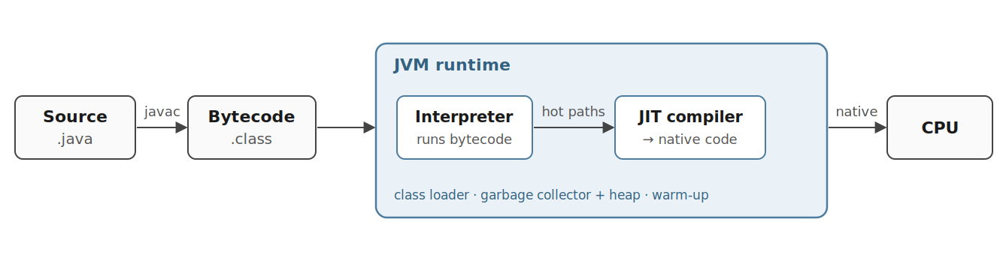
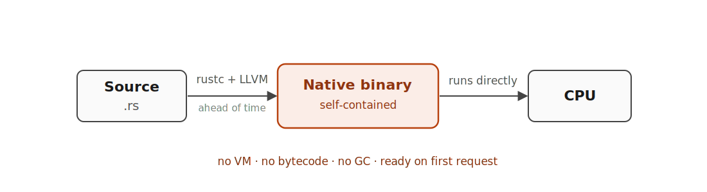
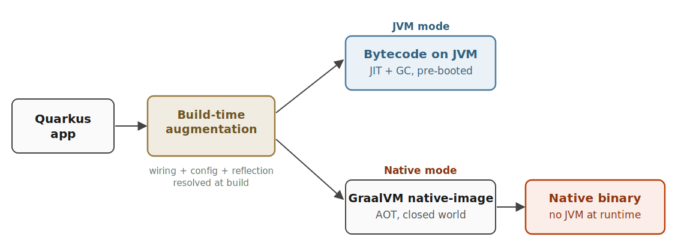
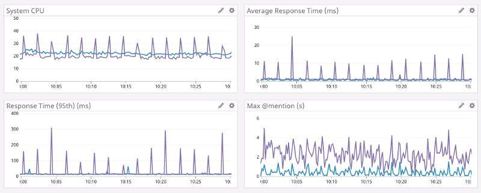

class: center, middle, inverse, title-slide

background-image: url(img/Tech_Rust.svg)
background-position: 85% 50%
background-size: 500pt

# Rust
## Efficiency Beyond the JVM
### Arild Nilsen, JPro

---

class: center, middle, inverse, title-slide

background-image: url(img/rust-robot-efficient.png)
background-position: 78% 50%
background-size: auto 100%

# Rust
## Efficiency Beyond the JVM
### Arild Nilsen, JPro

---

# Outline

### Part 1: Introduction to Rust

### Part 2: Efficiency vs the JVM

### Part 3: Rust in the Era of AI

---

class: center, middle, inverse

# Part 1
## Introduction to Rust

---

# Rust

.pull-left[
- Focus on speed & memory safety

- System level language

- Zero cost abstractions

- Fearless concurrency
]

.pull-right[

]

---

# Hello World

```rust
fn print_number(number: i32) {
    println!("The number is: {}", number);
}

fn main() {
    let number: i32 = 5;
    print_number(number);
}
```
! is a macro annotation

---

# If/else

```rust
fn my_function(number: i32) -> String {
    let result = if number > 0 {
        "Number is greater than zero"
    } else {
        "Number is not greater than zero"
    };

    result.to_owned()
}

fn main() {
    let text = my_function(5);
}
```
Variables are immutable by default

---

# Pattern matching + enums

```rust
enum WebEvent {
    PageLoad,
    KeyPress(char),
}

fn main() {
    let event = WebEvent::KeyPress('x');

    match event {
        WebEvent::PageLoad => println!("page loaded"),
        WebEvent::KeyPress(c) => println!("key pressed: {c}"),
    }
}
```

- A variant can carry data: `KeyPress(char)` does, `PageLoad` doesn't.
- `match` is **exhaustive**.

---

background-image: url(img/rust-memory-model.svg)
background-position: 50% 60%
background-size: 600pt

# The memory model

---

# Ownership

```rust
let s1: String = String::from("hello");
let s2: String = s1;
println!("{}, world!", s1); // Compilation error: ownership is moved

let x: i32 = 5;
let y: i32 = x;
println!("x = {}, y = {}", x, y);
```

```text
error[E0382]: borrow of moved value: `s1`
 --> src/main.rs:6:28

     let s1 = String::from("hello");
         -- move occurs because `s1` has type `String`
         -- which does not implement the `Copy` trait
     let s2 = s1;
              -- value moved here

     println!("{}, world!", s1);
                            ^^ value borrowed here after move
```

---

# Ownership Rules
1. Each value in Rust has an owner

2. There can only be one owner at a time

3. When the owner goes out of scope, the value will be dropped

---

# Ownership and Functions

```rust
fn main() {
    let s1 = gives_ownership(); // moves its return value into s1

    let s2 = String::from("hello"); // s2 comes into scope

    // s2 is moved into takes_and_gives_back,
    // which also moves its return value into s3
    let s3 = takes_and_gives_back(s2);
}
// s1 and s3 go out of scope and is dropped from the heap
// s2 goes out of scope but was moved, so nothing happens

fn gives_ownership() -> String {
    let some_string = String::from("Guten tag");
    some_string
}

fn takes_and_gives_back(a_string: String) -> String {
    a_string
}
```

---

# The Rules of References
1. At any given time, you can have either one mutable reference or any number of immutable references

2. References must always be valid

<br/><br/><br/>

|     Type    | Ownership             | Alias? |  Mutate?  |
| :------------| :--------------------|:-----: |:---------:|
| T           | Owned                 |        | ✓         |
| &T          | Shared reference      |    ✓   |           |
| &mut T      | Mutable reference     |        | ✓         |

---

# Lifetimes

- Lifetimes prevent dangling references.

```rust
fn longest(x: &str, y: &str) -> &str {
    if x.len() > y.len() { x } else { y }
}
```

```text
error[E0106]: missing lifetime specifier
 --> src/main.rs:1:33
  |
1 | fn longest(x: &str, y: &str) -> &str {
  |               ----     ----     ^ expected named lifetime parameter
  |
  = help: this function's return type contains a borrowed value, but the
          signature does not say whether it is borrowed from `x` or `y`
help: consider introducing a named lifetime parameter
  |
1 | fn longest<'a>(x: &'a str, y: &'a str) -> &'a str {
  |           ++++     ++          ++          ++
```

---

# Iterators + closures

```rust
fn sum_evens(numbers: &[i32]) -> i32 {
    numbers.iter()
        .filter(|n| *n % 2 == 0)
        .sum()
}
```

- Reads like a Kotlin sequence / Java stream.
- Compiles to a tight loop: **no heap allocation**, no virtual dispatch.
- Zero-cost abstraction in practice.

---

# `Option` and `Result` instead of `null` and exceptions

```rust
fn first_word(s: &str) -> Option<&str> {
    s.split_whitespace().next()
}

fn parse_age(s: &str) -> Result<u32, String> {
    s.parse()
        .map_err(|e| format!("not a number: {e}"))
}
```

- **No `null` & no exceptions**
- Still possible: **panics** `.unwrap()` on `None`/`Err`, index out of bounds, integer overflow.

---

# Tooling & Ecosystem

- **`cargo`**: build, test, run, publish, docs, benchmarks. One tool.
- **`clippy`**: lints.
- **`rustfmt`**: formatting.
- **`rust-analyzer`**: editor support in VS Code, IntelliJ, Vim, Emacs, Zed, Helix, Sublime.
- **`crates.io`**: 150k+ libraries.

---

background-image: url(img/stackoverflow-admired-2025-top.png)
background-position: 100% 50%
background-size: contain

# Most admired language

.pull-left[
- Rust tops Stack Overflow's **admired** ranking again in 2025.

- **72.4%** of its users want to keep using it, the most of any language.

- It has led the list every year since 2016.

- [survey.stackoverflow.co/2025/technology](https://survey.stackoverflow.co/2025/technology/)
]

???

"Admired" is a Stack Overflow survey metric: of the developers who have used the
language in the past year, the percentage who want to keep using it. It measures
retention among current users. It used to be called "loved" before the 2023 rename.

Its sibling metric is "desired": the percentage of all developers who want to use
the language, whether or not they have tried it. That measures appeal and hype.

The point to make: topping admired is stronger than topping desired. It is not
people who want to try Rust, it is people who already use it and do not want to
leave. High admired plus leading since 2016 means the enthusiasm survives contact
with the borrow checker.

---

class: center, middle, inverse

# Part 2
## Efficiency vs the JVM

---

# How the JVM runs code



- Compiles to **bytecode**, not machine code.
- Interpreted first, **JIT**-compiled when hot.
- Cost: **warm-up**, **GC** + heap.

???

Figure sketched in the deck style, not lifted from a source. Reference diagrams:
- ByteByteGo, "How the JVM Works": https://blog.bytebytego.com/p/ep211-how-the-jvm-works
- GeeksforGeeks, "How JVM Works / JVM Architecture": https://www.geeksforgeeks.org/java/how-jvm-works-jvm-architecture/

---

# How Rust runs code



- Compiled **ahead of time** to a **native binary** (LLVM).
- No VM, no bytecode: the **CPU runs it directly**.
- No GC: memory freed through **ownership**.
- **Ready on first request**: one self-contained binary.

???

Most of the room knows this already; it is a quick refresh to set up the contrast with the JVM.
The point to land: compile once, run the raw instructions, nothing underneath at runtime.

---

# Is the JIT necessary in 2026?

- **Original goal fits 2026 less well**
    - Portability: compile once, run anywhere
    - Warm up a long-lived process, then run fast
    - But containers pin the target, pods are short-lived

- **Pros**
    - Profile-guided optimization of hot paths
    - Speculative inlining + devirtualization, deopt when wrong
    - Tuned to the exact CPU, fast once warm
    - The only practical speed for dynamic languages (JS, Python)

???

The honest answer is "it depends on the workload". Containers killed the portability pillar;
ephemeral, dense, latency-sensitive cloud workloads weakened the warm-up-and-stay pillar.
Where the workload stays warm and throughput-bound, JIT still shines. The tell: the JVM world
is racing toward AOT (GraalVM native-image, Quarkus, CRaC, Project Leyden), which says which
way the wind is blowing. Dynamic languages (V8, Python, Ruby YJIT) keep JIT everywhere.

---

# Where Quarkus fits



- **Build time:** wiring, config, reflection resolved up front.
- **JVM mode:** bytecode on a normal JVM (JIT + GC), fast start from the build-time wiring.
- **Native mode:** GraalVM **AOT** to a native binary, no JVM. Instant startup and lean, but slower builds and no JIT.

???

The question from the room is usually "so is there a runtime?":
- JVM mode: yes, the full JVM with JIT and GC, cold-starting as a normal process. Nothing is kept warm or snapshotted, the framework wiring was just done at build time, so there is far less startup work than Spring Boot does on every boot.
- Native mode: no JVM; GraalVM produced a closed-world native binary (reflection needs build-time hints).
The ~30 MB vs ~200 MB figures are industry ballparks; replace with our own bench numbers once they land.
Reference diagrams / docs:
- Quarkus, "Building a Native Executable": https://quarkus.io/guides/building-native-image
- "GraalVM Native Image: Spring vs Quarkus": https://medium.com/swlh/graalvm-native-image-spring-vs-quarkus-a738263df069

---

# Side by side

<style>
.sbs { border-collapse: collapse; margin: 1em auto 0; }
.sbs th, .sbs td { padding: 0.55em 1.15em; text-align: center; border: none; }
.sbs thead th { background: #3A3A3A; color: #fff; font-weight: 700; }
.sbs thead th:first-child { background: transparent; }
.sbs thead th.rust { background: #B7410E; }
.sbs tbody th { text-align: left; font-weight: 700; color: #333; background: #efefef; }
.sbs tbody tr:nth-child(even) td:not(.rust) { background: #f7f7f7; }
.sbs td.rust { background: #FBEDE7; color: #8F3410; font-weight: 600; }
</style>

<table class="sbs">
  <thead>
    <tr><th></th><th class="rust">Rust</th><th>Quarkus native</th><th>JVM</th></tr>
  </thead>
  <tbody>
    <tr><th>Ships as</th><td class="rust">native binary</td><td>native binary</td><td>bytecode + a JVM</td></tr>
    <tr><th>Startup</th><td class="rust">ready on first request</td><td>milliseconds</td><td>class loading, then JIT warm-up</td></tr>
    <tr><th>Hot paths</th><td class="rust">compiled ahead of time</td><td>compiled ahead of time</td><td>JIT-compiled while running</td></tr>
    <tr><th>Memory</th><td class="rust">no GC, what you allocate</td><td>small heap + GC</td><td>heap + GC + runtime overhead</td></tr>
  </tbody>
</table>

---

# Home Made Performance Test

- Workload modelled after **posten-parcel-api**.
- Each request re-parses and re-serializes **100 parcels (~396 KB JSON)**.
- Plus **synthetic per-request computation** on each parcel (derived features).
- Each variant in its own container, capped at **3 CPUs and 1 GiB RAM**.
- **vegeta** at max load. Measuring cold start, memory, CPU, throughput.

???

posten-parcel-api is the real Posten service the workload is modelled on. Re-parsing 396 KB on
every request is a deliberate stressor, it puts JSON and allocation cost on the hot path, plus a
synthetic per-parcel computation of derived features so it is not pure serialization. A
caching service would narrow the gap.

The 1 GiB limit mirrors a Kubernetes pod and keeps memory comparable. The JVM GCs and GraalVM
native default their max heap to about 25% of container memory, roughly 268 MB here. Rust has
no GC, so its memory is workload-bound.

The native bar is Oracle GraalVM with G1, native at its tuned best. The free Mandrel default
uses Serial GC and does about 3x fewer requests per second, so it is omitted for simplicity.

---

# Results

<style>
.res { border-collapse: collapse; margin: 0.9em auto 0; font-size: 24px; }
.res th, .res td { padding: 0.5em 0.7em; text-align: right; border: none; }
.res thead th { background: #3A3A3A; color: #fff; font-weight: 700; text-align: center; }
.res thead tr:first-child th:first-child { background: transparent; }
.res tbody th { text-align: left; font-weight: 700; color: #333; background: #efefef; }
.res tbody tr:nth-child(even):not(.rust) td { background: #f7f7f7; }
.res tbody tr.rust th { background: #B7410E; color: #fff; }
.res tbody tr.rust td { background: #FBEDE7; color: #8F3410; font-weight: 700; }
</style>

<table class="res">
  <thead>
    <tr>
      <th rowspan="2"></th>
      <th colspan="2">Cold start (s)</th>
      <th colspan="3">Memory (MB)</th>
      <th colspan="2">CPU (cores)</th>
      <th rowspan="2">Req/s</th>
    </tr>
    <tr>
      <th>med</th><th>p95</th>
      <th>Idle</th><th>Warm</th><th>Peak</th>
      <th>Warm</th><th>Peak</th>
    </tr>
  </thead>
  <tbody>
    <tr><th>Spring Boot</th><td>1.90</td><td>2.00</td><td>180</td><td>224</td><td>468</td><td>1.32</td><td>2.51</td><td>318</td></tr>
    <tr><th>Quarkus (JVM)</th><td>0.67</td><td>0.76</td><td>83</td><td>199</td><td>401</td><td>1.50</td><td>2.57</td><td>350</td></tr>
    <tr><th>Quarkus native</th><td>0.10</td><td>0.11</td><td>6.5</td><td>63</td><td>293</td><td>1.11</td><td>2.64</td><td>282</td></tr>
    <tr class="rust"><th>Rust</th><td>0.10</td><td>0.11</td><td>2.1</td><td>7.2</td><td>12.8</td><td>0.60</td><td>1.64</td><td>860</td></tr>
  </tbody>
</table>

???

Rust does roughly 2.5x the throughput on a fraction of the memory. The native bar starts as fast
as Rust but its G1 heap still sizes to about 25% of the 1 GiB limit, so peak memory stays near
293 MB. Quarkus on the JVM is the easy win over Spring Boot, faster start and leaner.

Provenance: the 2026-06-11 clean run. Post-cleanup, every port returns the same bare JSON array,
byte-identical payloads, and all metrics land within run-to-run variance of the earlier June run.
Build times on the next slide are carried over from that earlier run.

---

# Build & size

<table class="res">
  <thead>
    <tr><th></th><th>Build (s)</th><th>Artifact (MB)</th><th>Runtime (MB)</th><th>Image (MB)</th></tr>
  </thead>
  <tbody>
    <tr><th>Spring Boot</th><td>8</td><td>32.9</td><td>196.0</td><td>259</td></tr>
    <tr><th>Quarkus (JVM)</th><td>6</td><td>28.6</td><td>196.0</td><td>255</td></tr>
    <tr><th>Quarkus native</th><td>297</td><td>91.2</td><td>none</td><td>120</td></tr>
    <tr class="rust"><th>Rust</th><td>119</td><td>14.5</td><td>none</td><td>50</td></tr>
  </tbody>
</table>

???

Build column is the containerized image rebuild, read it as orders of magnitude. JVM rebuilds in
6-8 s. Rust takes about 2 min because Docker layers are not incremental, a local cargo build is
seconds. Native takes about 5 min, native-image re-analyses the whole closure every build.

Image is Artifact plus Runtime plus a thin OS base plus the shared parcel-data fixtures. Runtime is
now measured directly, the language VM the image ships as a separate component, not the base image
as a whole. The JVM ships a 196.0 MB JRE under a 33 MB jar on an Alpine base, that is where the
259 MB image goes. Rust and native have no separate runtime, they compile it into the binary, so
the artifact carries the weight, which is why Rust's image is the smallest of these four at 50 MB.
Go and C join on the full lineup slides later.

---

# Azure Savings

- **25 Spring Boot services**: ~**50 GiB**, ~**14 cores** reserved.

- **Memory** is the lever: Rust frees **~70-85%**, ~**$5-8k/year**.

- **CPU** ~**2x** lower makes the freed nodes real, ~**$2.5-4k/year**.

???

The absolute number is modest because the footprint is small, about 2-3 nodes total. The cost
case alone does not justify rewriting everything. Right-sizing over-provisioned JVM requests
captures part of the saving today for free. The defensible story is selective Rust for the
high-replica, high-traffic services like posten-parcel-api and postenid, plus new services,
not a fleet-wide rewrite.

CPU: measured 4.1x less CPU per request, 7.9 vs 1.9 millicore-seconds, but the stub is
allocation-heavy and exaggerates the JVM's GC cost, so the estimate haircuts it to 1.5-2.5x,
same logic as the memory factors. Why it matters: after a Rust migration memory drops below one
node's allocatable, so CPU becomes the binding constraint. At the full 14 cores the fleet would
still need 2 nodes; at 6-9.5 it fits about 1, which is what makes the freed nodes real.
Standalone that is worth about $2.5-4k/year, but do not add it to the memory figure, both
savings are realized through the same freed nodes.

---

# What about Go, C and Node?

<style>
.res.gc tbody tr.old th, .res.gc tbody tr.old td { font-size: 17px; padding-top: 0.3em; padding-bottom: 0.3em; }
.res.gc tbody tr.old th { color: #999; background: #f4f4f4; font-weight: 600; }
.res.gc tbody tr.old td { color: #999; background: #fff; }
.res.gc tbody tr.new th { background: #2E8B57; color: #fff; }
.res.gc tbody tr.new td { background: #E7F5E9; color: #1B5E20; font-weight: 700; }
</style>

<table class="res gc">
  <thead>
    <tr>
      <th rowspan="2"></th>
      <th colspan="2">Cold start (s)</th>
      <th colspan="3">Memory (MB)</th>
      <th colspan="2">CPU (cores)</th>
      <th rowspan="2">Req/s</th>
    </tr>
    <tr>
      <th>med</th><th>p95</th>
      <th>Idle</th><th>Warm</th><th>Peak</th>
      <th>Warm</th><th>Peak</th>
    </tr>
  </thead>
  <tbody>
    <tr class="old"><th>Spring Boot</th><td>1.90</td><td>2.00</td><td>180</td><td>224</td><td>468</td><td>1.32</td><td>2.51</td><td>318</td></tr>
    <tr class="old"><th>Quarkus (JVM)</th><td>0.67</td><td>0.76</td><td>83</td><td>199</td><td>401</td><td>1.50</td><td>2.57</td><td>350</td></tr>
    <tr class="old"><th>Quarkus native</th><td>0.10</td><td>0.11</td><td>6.5</td><td>63</td><td>293</td><td>1.11</td><td>2.64</td><td>282</td></tr>
    <tr class="new"><th>Node</th><td>0.30</td><td>0.35</td><td>98</td><td>99</td><td>177</td><td>0.81</td><td>2.25</td><td>304</td></tr>
    <tr class="new"><th>Go</th><td>0.09</td><td>0.10</td><td>2.8</td><td>9.1</td><td>33.1</td><td>0.79</td><td>2.63</td><td>383</td></tr>
    <tr class="old"><th>Rust</th><td>0.10</td><td>0.11</td><td>2.1</td><td>7.2</td><td>12.8</td><td>0.60</td><td>1.64</td><td>860</td></tr>
    <tr class="new"><th>C</th><td>0.10</td><td>0.11</td><td>1.6</td><td>2.9</td><td>3.0</td><td>0.42</td><td>0.69</td><td>944</td></tr>
  </tbody>
</table>

???

Same table as before with three new rows. All three new ports do the identical per-request work
and return byte-identical payloads. Go starts as fast as the natives and stays lean, but its GC
shows under load, peak memory 33 MB versus Rust's 13, and 383 req/s is under half of Rust's 860.

The C port runs on the h2o library's event loop. It tops the throughput chart at 944 req/s, but
look at peak CPU: 0.69 of 3 cores. The single-threaded loop never saturated the CPU, so 944 is
a floor, not its ceiling, and its CPU-per-request is not cleanly comparable to the others. C is
here as the bare-metal reference, the talk lineup stays Spring Boot, Quarkus, Rust.

Node is the new arrival. It runs Fastify behind the node:cluster module, forking one worker per
core, 3 under --cpus 3, so it reaches 2.25 of 3 cores and 304 req/s, genuinely multi-core like Go
and the JVMs. That is 2.2x the single-process node:http version it replaced (137 req/s at 0.96
cores). The cost is memory: three full Node processes push idle memory to 98 MB and peak to 177 MB,
and cold start to 0.30 s since each worker boots Fastify and loads its own parcel copy.

The big picture across all seven: startup, everything compiled ahead of time lands at 0.1 s,
Node 0.30 s, the JVM variants pay 0.67 to 1.9 s. Peak memory: C 3.0 below Rust 13 below Go 33
below Node 177 below native 293 below the JVMs. Throughput: C 944 and Rust 860 in a league of
their own, then Go 383, then Node 304 and the JVM/native band around 282-350. Rust gives C-class
efficiency with memory safety and a modern web stack, which is the point of the whole comparison.

---

# The full lineup: build & size

<table class="res">
  <thead>
    <tr><th></th><th>Build (s)</th><th>Artifact (MB)</th><th>Runtime (MB)</th><th>Image (MB)</th></tr>
  </thead>
  <tbody>
    <tr><th>Spring Boot</th><td>8</td><td>32.9</td><td>196.0</td><td>259</td></tr>
    <tr><th>Quarkus (JVM)</th><td>6</td><td>28.6</td><td>196.0</td><td>255</td></tr>
    <tr><th>Quarkus native</th><td>297</td><td>91.2</td><td>none</td><td>120</td></tr>
    <tr><th>Node</th><td>2</td><td>7.3</td><td>120.7</td><td>166</td></tr>
    <tr><th>Go</th><td>10</td><td>5.7</td><td>none</td><td>9.5</td></tr>
    <tr class="rust"><th>Rust</th><td>119</td><td>14.5</td><td>none</td><td>50</td></tr>
    <tr><th>C</th><td>8</td><td>0.3</td><td>none</td><td>37.2</td></tr>
  </tbody>
</table>

???

Same build caveats as the earlier slide, read it as orders of magnitude. Go rebuilds its image
in about 10 s, close to the JVM jars, and ships the smallest image of all at 9.5 MB. C rebuilds
in about 8 s warm, around 30 s cold when the Dockerfile apt-installs the h2o toolchain before
that layer is cached. Node rebuilds in about 2 s warm, around 10-15 s cold when npm ci installs
Fastify in the build stage. Rust stays at about 2 min for the image rebuild, seconds locally.

The Runtime column is the language VM the image ships as a separate component, measured directly
from its directory in the image, not the base image as a whole. Only Node and the JVMs have one.
The JVMs ship a 196.0 MB JRE, Node a 120.7 MB Node.js runtime, alongside a tiny app. Go, Rust,
C, and native have no separate runtime, they compile it into the binary in the Artifact column,
Go and Rust statically, C as native code over libc, native baking the GraalVM substrate into its
91 MB binary, so the column shows none. The rest of each image is a thin OS base, Alpine about
29 MB under the JVMs, distroless Debian under Node/Go/Rust/C, UBI micro about 27 MB under native.
So the pattern is Node and JVM ship a big runtime VM plus a small app, the compiled four have the
runtime inside the binary and no separate VM.

---

# Sustainability with Rust

<style>
.eff { border-collapse: collapse; margin: 0.6em auto 0; font-size: 24px; }
.eff th, .eff td { padding: 0.38em 1.4em; border: none; }
.eff thead th { background: #3A3A3A; color: #fff; font-weight: 700; text-align: center; }
.eff thead th:first-child { background: transparent; }
.eff thead th small { display: block; font-weight: 400; font-size: 0.6em; opacity: 0.85; }
.eff tbody th { text-align: left; font-weight: 700; color: #333; background: #efefef; }
.eff td { text-align: right; }
.eff tbody tr:nth-child(even) td:not(.en) { background: #f7f7f7; }
.eff .sep th, .eff .sep td { color: #bbb; text-align: center; }
.eff .sep .en { color: #1B5E20; }
.eff .en { background: #E7F5E9; color: #1B5E20; font-weight: 700;
           border-left: 3px solid #2E8B57; border-right: 3px solid #2E8B57; }
.eff thead .en { background: #2E8B57; color: #fff; border-top: 3px solid #2E8B57; }
.eff tbody tr:last-child .en { border-bottom: 3px solid #2E8B57; }
</style>

<table class="eff">
  <thead>
    <tr><th></th><th class="en">Energy<small>C = 1.00</small></th><th>Time<small>C = 1.00</small></th></tr>
  </thead>
  <tbody>
    <tr><th>C</th><td class="en">1.00</td><td>1.00</td></tr>
    <tr><th>Rust</th><td class="en">1.03</td><td>1.04</td></tr>
    <tr><th>C++</th><td class="en">1.34</td><td>1.56</td></tr>
    <tr><th>Ada</th><td class="en">1.70</td><td>1.85</td></tr>
    <tr><th>Java</th><td class="en">1.98</td><td>1.89</td></tr>
    <tr class="sep"><th>⋮</th><td class="en">⋮</td><td>⋮</td></tr>
    <tr><th>Go</th><td class="en">3.23</td><td>2.83</td></tr>
    <tr class="sep"><th>⋮</th><td class="en">⋮</td><td>⋮</td></tr>
    <tr><th>Python</th><td class="en">75.88</td><td>71.90</td></tr>
  </tbody>
</table>

<div style="position: absolute; bottom: 1em; left: 0; right: 0; text-align: center; font-size: 95%;"><a href="https://aws.amazon.com/blogs/opensource/sustainability-with-rust/" style="color: #B7410E;">aws.amazon.com/blogs/opensource/sustainability-with-rust</a></div>

???

The figure is the Pereira et al. ranking, "Energy Efficiency across Programming
Languages", reproduced in the AWS post. Values are normalized to C at 1.00 on the
same benchmarks, so lower is greener and faster.

The story in the numbers: Rust (1.03) sits right next to C, uses about half the
energy of Java (1.98) and roughly 1.4% of Python (75.88), the 98% the article
quotes. The full ranking is 27 languages, I show the top, Go in the middle, and Python
at the bottom. Go lands at 3.23 energy, rank 14, below Java's 1.98 and about 3x Rust,
its garbage collector and the benchmark mix cost it even though it is compiled.

Energy tracks time closely because energy is power times time, and the compiled
languages keep power low, so Rust lands within 4% of C on both. AWS puts the payoff
at up to 50% lower compute energy if the industry moved broadly to C and Rust,
flagged as conservative. Rust gives C's efficiency without the undefined behavior,
and already runs Firecracker, Lambda, and S3.

---

# Discord: Go → Rust

- Go's GC forced a collection **every 2 minutes**, spiking latency each time.
- The Rust rewrite beat Go on **latency, CPU, and memory**, with no spikes.


<div style="text-align: center; font-size: 75%; color: #666;">Go is purple, Rust is blue</div>

<div style="position: absolute; bottom: 1em; left: 0; right: 0; text-align: center; font-size: 95%;"><a href="https://discord.com/blog/why-discord-is-switching-from-go-to-rust" style="color: #B7410E;">discord.com/blog/why-discord-is-switching-from-go-to-rust</a></div>

???

The 2020 article about Discord's Read States service, it tracks which channels and messages
you've read. The Go version kept a big LRU cache with millions of entries, and Go's collector
runs at least every 2 minutes and scans the whole cache each time, so latency spiked like
clockwork even though nothing was wrong.

The figure is the side-by-side from the article, Go in purple, Rust in blue. Go spikes on CPU
and response time every 2 minutes, Rust stays flat on all four panels, and the max @mention
panel shows roughly half the latency on top of losing the spikes.

Rust has no collector, ownership frees memory the moment it goes out of scope, so the spikes
disappeared entirely. Even the barely optimized first Rust version outperformed the hand-tuned
Go one, and after tuning they raised the cache to 8 million entries, which the GC made
impossible in Go.

This is the GC angle in one story: peak throughput is real, but a managed runtime trades it
against tail-latency spikes when the collector runs.

---

# TikTok: only the hot path

- Payment service for TikTok LIVE, written in Go, CPU-bound on a few endpoints.
- They rewrote **only those endpoints** in Rust. The rest of the service stayed Go.
- **2x throughput** on the same hardware, **~$300k/year** saved in cloud costs.

<div style="position: absolute; bottom: 1em; left: 0; right: 0; text-align: center; font-size: 95%;"><a href="https://wxiaoyun.com/blog/rust-rewrite-case-study/" style="color: #B7410E;">wxiaoyun.com/blog/rust-rewrite-case-study</a></div>

???

A 2025 case study from TikTok. Flame graphs showed a few balance and statistics endpoints
eating most of the CPU, so instead of a full rewrite they did a surgical one, just the hot
endpoints in Rust, the rest stayed Go. Rollout was careful: weeks in shadow mode comparing
every Rust response against the Go service before switching, then stress tests on identical
clusters. Go buckled at 85k QPS, Rust passed 150k on the same hardware, and a second endpoint
went from 105k to a clean 210k.

This is the playbook I would suggest for us: not a fleet-wide rewrite, but Rust for the
high-traffic hot paths where the savings estimate says it actually pays.

---

# Cloudflare Pingora

- Rust proxy that replaced NGINX.
- Serves **1 trillion+** requests a day.
- **~70% less CPU** and **~67% less memory** at the same traffic.
- 2025: they doubled down. FL2 rewrote the core proxy in Rust too, **25% faster** on **less than half the CPU**.

<div style="position: absolute; bottom: 1em; left: 0; right: 0; text-align: center; font-size: 95%;"><a href="https://blog.cloudflare.com/how-we-built-pingora-the-proxy-that-connects-cloudflare-to-the-internet/" style="color: #B7410E;">blog.cloudflare.com/how-we-built-pingora</a> · <a href="https://blog.cloudflare.com/20-percent-internet-upgrade/" style="color: #B7410E;">blog.cloudflare.com/20-percent-internet-upgrade</a></div>

???

The 2022 article about Cloudflare's in-house Rust proxy. Same story as our benchmark, less CPU
and memory for the same work, just at Cloudflare scale. They also report fewer outages and
faster feature work, and better connection reuse from a multi-threaded design instead of
NGINX's multi-process model.

The FL2 bullet is from the September 2025 article. FL1, the original NGINX-based core proxy
that fronts roughly 20% of the web, was replaced with a modular Rust proxy through 2025.
Websites respond 10 ms faster at the median, a 25% boost in third-party CDN tests, on less
than half the CPU and much less than half the memory of FL1. Pingora was not a one-off, the
same company keeps picking Rust for its most loaded systems.

---

# TechEmpower benchmarks

- Community benchmark of web frameworks, **841** implementations in Round 23.
- The realistic test is *Fortunes*: database query, HTML templating, unicode.

<style>
.tfb { border-collapse: collapse; margin: 0.5em auto 0; font-size: 21px; }
.tfb th, .tfb td { padding: 0.3em 1.1em; border: none; }
.tfb thead th { background: #3A3A3A; color: #fff; font-weight: 700; text-align: center; }
.tfb thead th small { display: block; font-weight: 400; font-size: 0.6em; opacity: 0.85; }
.tfb tbody th { text-align: left; font-weight: 700; color: #333; background: #efefef; }
.tfb tbody td { text-align: right; }
.tfb tbody td.lang { text-align: left; }
.tfb td.rust { color: #B7410E; font-weight: 700; }
.tfb tbody tr:nth-child(even) td:not(.rps) { background: #f7f7f7; }
.tfb .sep th, .tfb .sep td { color: #bbb; text-align: center; }
.tfb .sep .rps { color: #8C3A10; }
.tfb .rps { background: #FBEDE6; color: #8C3A10; font-weight: 700;
            border-left: 3px solid #B7410E; border-right: 3px solid #B7410E; }
.tfb thead .rps { background: #B7410E; color: #fff; border-top: 3px solid #B7410E; }
.tfb tbody tr:last-child .rps { border-bottom: 3px solid #B7410E; }
</style>

<table class="tfb">
  <thead>
    <tr><th>Rnk</th><th>Framework</th><th>Language</th><th class="rps">Requests/s<small>Fortunes, Round 23</small></th></tr>
  </thead>
  <tbody>
    <tr><td>1</td><th>may-minihttp</th><td class="lang rust">Rust</td><td class="rps">1,327,378</td></tr>
    <tr><td>2</td><th>h2o</th><td class="lang">C</td><td class="rps">1,226,814</td></tr>
    <tr><td>3</td><th>ntex</th><td class="lang rust">Rust</td><td class="rps">1,210,348</td></tr>
    <tr><td>5</td><th>xitca-web</th><td class="lang rust">Rust</td><td class="rps">1,146,712</td></tr>
    <tr><td>7</td><th>axum</th><td class="lang rust">Rust</td><td class="rps">1,114,265</td></tr>
    <tr><td>13</td><th>vert.x</th><td class="lang">Java</td><td class="rps">1,040,599</td></tr>
    <tr><td>14</td><th>quarkus (on vert.x)</th><td class="lang">Java</td><td class="rps">1,028,408</td></tr>
    <tr class="sep"><td>⋮</td><th>⋮</th><td class="lang">⋮</td><td class="rps" rowspan="2" style="text-align: center; vertical-align: middle; font-size: 30px; color: #8C3A10; border-bottom: 3px solid #B7410E;">243,639<br><span style="font-size: 15px; font-weight: 400;">~18% of #1</span></td></tr>
    <tr><td></td><th>spring</th><td class="lang">Java</td></tr>
  </tbody>
</table>

<div style="position: absolute; bottom: 1em; left: 0; right: 0; text-align: center; font-size: 95%;"><a href="https://www.techempower.com/benchmarks/#section=data-r23" style="color: #B7410E;">techempower.com/benchmarks #section=data-r23</a></div>

???

Round 23 came out in February 2025, the first round on new 40-gigabit hardware, with 841
framework implementations tested across every major language. Fortunes is the test worth
pointing at. It hits the database, renders the rows as server-side HTML, and handles unicode
and escaping, the closest thing to a real endpoint.

The table is the official Round 23 Fortunes chart, top 14 by best requests per second. The
skipped ranks are variants of frameworks already shown (4 is ntex on another runtime, 6 is
xitca-web with an ORM) plus more Rust and C++ entries (hyper, viz, lithium, drogon). The first
JVM entries are vert.x at 13 and Quarkus on vert.x at 14, at about 78% of the Rust leader, and
those are the reactive stacks, not Spring.

The Spring figure, 243,639 requests per second, about 18% of the leader, is from a secondary
analysis of the Round 23 data (tuananhpham on dev.to). It is most likely the classic
non-reactive Spring Boot MVC implementation (the TFB entry named "spring", servlet stack with
a full ORM), though the article does not name the exact variant, and R23 also ran a
spring-webflux entry. The official chart only published the top 14 and Spring's exact global
rank is not recoverable now that the backend is gone. The statement that is rock solid: no
Spring variant is anywhere near the top 14, and the JVM entries that are need a reactive
stack to get there.

If someone asks about actix: several actix variants had startup problems in Round 23, so it is
absent from this top list, axum is the mainstream Rust entry here.

Honest footnote if asked: Round 23 turned out to be the final round. The project was archived
in 2025 and the data backend is offline now, so the link is a reference, not a live demo. The
numbers here are from the published Round 23 chart captured before the backend went away.

---

class: center, middle, inverse

# Part 3
## Rust in the Era of AI

---

class: center, middle

# An accidental fit

<div style="max-width: 780px; margin: 0 auto; text-align: left; background: #fff; border: 1px solid #cfd9de; border-radius: 16px; padding: 22px 30px; box-shadow: 0 6px 28px rgba(0,0,0,0.10); font-family: 'Helvetica Neue', Arial, sans-serif;">
  <div style="display: flex; align-items: center; margin-bottom: 18px;">
    <div style="width: 54px; height: 54px; border-radius: 50%; background: #1d9bf0; color: #fff; display: flex; align-items: center; justify-content: center; font-size: 26px; font-weight: 700;">D</div>
    <div style="margin-left: 12px; line-height: 1.25;">
      <div style="font-weight: 700; color: #0f1419; font-size: 21px;">Dwayne</div>
      <div style="color: #536471; font-size: 17px;">@CtrlAltDwayne</div>
    </div>
    <i class="fab fa-twitter" style="margin-left: auto; color: #1d9bf0; font-size: 28px;"></i>
  </div>
  <div style="color: #0f1419; font-size: 26px; line-height: 1.45;">
    The best argument for Rust in 2026 is not memory safety or performance. It is that AI writes better Rust than it writes C++. The compiler feedback loop is so tight that models self-correct in real time. Every error message is a free training signal&hellip;
  </div>
  <div style="color: #536471; font-size: 15px; margin-top: 18px;">9:27 AM &middot; Mar 13, 2026</div>
</div>

<div style="position: absolute; bottom: 1em; left: 0; right: 0; text-align: center; font-size: 95%;"><a href="https://x.com/CtrlAltDwayne/status/2032388050584736157" style="color: #1d9bf0;">https://x.com/CtrlAltDwayne/status/2032388050584736157</a></div>

---

# Rust, before and after agentic AI

<div style="position: relative; margin: 1.6em 14px 0; height: 60px;">
  <div style="position: absolute; top: 8px; left: 0; right: 0; height: 4px; border-radius: 2px; background: linear-gradient(to right, #C62828 0%, #C62828 46%, #2E8B57 54%, #2E8B57 100%);"></div>
  <div style="position: absolute; top: 1px; right: -2px; width: 0; height: 0; border-left: 14px solid #2E8B57; border-top: 9px solid transparent; border-bottom: 9px solid transparent;"></div>
  <div style="position: absolute; top: 2px; left: 1%; width: 16px; height: 16px; border-radius: 50%; background: #C62828;"></div>
  <div style="position: absolute; top: 28px; left: 0; font-size: 17px; color: #555;">2015 · Rust 1.0</div>
  <div style="position: absolute; top: 0; left: 50%; transform: translateX(-50%); width: 20px; height: 20px; border-radius: 50%; background: #fff; border: 4px solid #3A3A3A;"></div>
  <div style="position: absolute; top: 28px; left: 50%; transform: translateX(-50%); font-size: 17px; font-weight: 700; color: #121212;">2024 · coding agents arrive</div>
  <div style="position: absolute; top: 28px; right: 0; font-size: 17px; color: #555;">2026</div>
</div>

<div style="display: flex; gap: 28px; margin: 14px 14px 0;">
  <div style="flex: 1; background: #FDECEA; border-top: 4px solid #C62828; border-radius: 10px; padding: 14px 20px;">
    <div style="font-weight: 700; color: #C62828; font-size: 21px; margin-bottom: 8px;">Before</div>
    <ul style="margin: 0; padding-left: 1.1em; font-size: 19px; line-height: 1.55;">
      <li>Hard to get Rust developers, a small and expensive pool</li>
      <li>The borrow checker, a nightmare for newcomers</li>
      <li>Months before a team felt productive</li>
    </ul>
  </div>
  <div style="flex: 1; background: #E7F5E9; border-top: 4px solid #2E8B57; border-radius: 10px; padding: 14px 20px;">
    <div style="font-weight: 700; color: #2E8B57; font-size: 21px; margin-bottom: 8px;">After</div>
    <ul style="margin: 0; padding-left: 1.1em; font-size: 19px; line-height: 1.55;">
      <li>Lower threshold to onboard, AI explains every borrow checker error</li>
      <li>Tops 9 languages on SWE-bench (agentic)</li>
    </ul>
  </div>
</div>

???

The before side is the classic objection, and it was fair. Matt Welsh wrote the famous 2022
"Rust at a startup, a cautionary tale" about exactly this: steep learning curve, small hiring
pool, velocity loss. In 2026 he published a follow-up, "Revisiting Rust", and the biggest
change he names is LLMs. You can ask the model all the dumb questions without bothering a
colleague, he reports cranking out tens of thousands of lines and feeling far more productive.

The after side has numbers behind it: on SWE-bench Multilingual, agents complete 58% of Rust
tasks, the best of the 9 languages tested, because the compiler gives the agent a deterministic
feedback loop to iterate against. Tools like RustCoder and Copilot Chat explain borrow checker
errors in plain language against your own code, which is what lowers the onboarding threshold.

Honest caveats, also for questions: one-shot generation still favors Python and Ruby, 1.4 to
2.6x faster and cheaper, Rust wins in the iterative agentic setting. Welsh warns AI Rust can be
non-idiomatic slop in load-bearing code, so juniors should not vibe-code what they cannot read.
And the hiring pool, while easier to onboard into, is still small, JS and Python applicants
outnumber Rust by orders of magnitude.

---

# SWE-bench: agents on real issues

- **300 real GitHub issues**, 42 repos, 9 languages. The agent must fix the issue and pass the repo's tests.
- **Rust issues get resolved most often.**

<div style="width: 700px; margin: 1.0em auto 0;">
  <div style="display: flex; align-items: center; gap: 12px; margin: 7px 0;">
    <div style="width: 100px; text-align: right; font-size: 18px; font-weight: 700;">Rust</div>
    <div style="flex: 1; position: relative;">
      <div style="width: 58.14%; height: 25px; background: #B7410E; border-radius: 0 6px 6px 0;"></div>
      <span style="position: absolute; left: calc(58.14% + 10px); top: 50%; transform: translateY(-50%); font-size: 17px; font-weight: 700; color: #8C3A10;">58.1%</span>
    </div>
  </div>
  <div style="display: flex; align-items: center; gap: 12px; margin: 7px 0;">
    <div style="width: 100px; text-align: right; font-size: 18px; font-weight: 400;">Java</div>
    <div style="flex: 1; position: relative;">
      <div style="width: 53.49%; height: 25px; background: #C9C9C9; border-radius: 0 6px 6px 0;"></div>
      <span style="position: absolute; left: calc(53.49% + 10px); top: 50%; transform: translateY(-50%); font-size: 17px; font-weight: 400; color: #666;">53.5%</span>
    </div>
  </div>
  <div style="display: flex; align-items: center; gap: 12px; margin: 7px 0;">
    <div style="width: 100px; text-align: right; font-size: 18px; font-weight: 400;">PHP</div>
    <div style="flex: 1; position: relative;">
      <div style="width: 48.84%; height: 25px; background: #C9C9C9; border-radius: 0 6px 6px 0;"></div>
      <span style="position: absolute; left: calc(48.84% + 10px); top: 50%; transform: translateY(-50%); font-size: 17px; font-weight: 400; color: #666;">48.8%</span>
    </div>
  </div>
  <div style="display: flex; align-items: center; gap: 12px; margin: 7px 0;">
    <div style="width: 100px; text-align: right; font-size: 18px; font-weight: 400;">Ruby</div>
    <div style="flex: 1; position: relative;">
      <div style="width: 43.18%; height: 25px; background: #C9C9C9; border-radius: 0 6px 6px 0;"></div>
      <span style="position: absolute; left: calc(43.18% + 10px); top: 50%; transform: translateY(-50%); font-size: 17px; font-weight: 400; color: #666;">43.2%</span>
    </div>
  </div>
  <div style="display: flex; align-items: center; gap: 12px; margin: 7px 0;">
    <div style="width: 100px; text-align: right; font-size: 18px; font-weight: 400;">JS / TS</div>
    <div style="flex: 1; position: relative;">
      <div style="width: 34.88%; height: 25px; background: #C9C9C9; border-radius: 0 6px 6px 0;"></div>
      <span style="position: absolute; left: calc(34.88% + 10px); top: 50%; transform: translateY(-50%); font-size: 17px; font-weight: 400; color: #666;">34.9%</span>
    </div>
  </div>
  <div style="display: flex; align-items: center; gap: 12px; margin: 7px 0;">
    <div style="width: 100px; text-align: right; font-size: 18px; font-weight: 400;">Go</div>
    <div style="flex: 1; position: relative;">
      <div style="width: 30.95%; height: 25px; background: #C9C9C9; border-radius: 0 6px 6px 0;"></div>
      <span style="position: absolute; left: calc(30.95% + 10px); top: 50%; transform: translateY(-50%); font-size: 17px; font-weight: 400; color: #666;">31.0%</span>
    </div>
  </div>
  <div style="display: flex; align-items: center; gap: 12px; margin: 7px 0;">
    <div style="width: 100px; text-align: right; font-size: 18px; font-weight: 400;">C / C++</div>
    <div style="flex: 1; position: relative;">
      <div style="width: 28.57%; height: 25px; background: #C9C9C9; border-radius: 0 6px 6px 0;"></div>
      <span style="position: absolute; left: calc(28.57% + 10px); top: 50%; transform: translateY(-50%); font-size: 17px; font-weight: 400; color: #666;">28.6%</span>
    </div>
  </div>
</div>

<div style="position: absolute; bottom: 1em; left: 0; right: 0; text-align: center; font-size: 95%;"><a href="https://www.swebench.com/multilingual.html" style="color: #B7410E;">swebench.com/multilingual.html</a></div>

???

SWE-bench Multilingual, from the SWE-bench team. Each task is a real GitHub issue plus its
repository, the agent has to produce a patch that makes the repo's own tests pass. The run
shown is SWE-agent with Claude 3.7 Sonnet under a 2.50 dollar per-task cost cap, 128 of 300
resolved overall, 42.7%.

Rust tops the chart at 58%, and the likely reason is the thesis of this part of the talk: the
compiler gives the agent a structured, deterministic feedback loop to iterate against, the same
strictness that costs humans on the learning curve. Worth a smile for this room: Java is number
two at 53%, the JVM is fine here too. C and C++ sit at the bottom.

Caveats if asked: one model and one agent (the authors only evaluated Claude 3.7 Sonnet due to
budget), and the per-language samples are small, 42 to 44 tasks each, so one task is worth
about 2 percentage points. Direction is solid, exact ordering between neighbors is not.

---

# Climbing the TIOBE index

- TIOBE ranks language popularity, mostly from search engine volume.
- Rust reached **#8** in November 2025, up from **#17** a year earlier.

<div style="display: flex; align-items: flex-end; justify-content: center; gap: 48px; margin-top: 1.4em;">
  <div style="text-align: center;">
    <div style="font-size: 30px; font-weight: 700; color: #888; margin-bottom: 4px;">#17</div>
    <div style="width: 130px; height: 40px; background: #C9C9C9; border-radius: 6px 6px 0 0;"></div>
    <div style="font-size: 18px; color: #555; margin-top: 6px;">Nov 2024</div>
  </div>
  <div style="text-align: center;">
    <div style="font-size: 30px; font-weight: 700; color: #777; margin-bottom: 4px;">#13</div>
    <div style="width: 130px; height: 100px; background: #9C9C9C; border-radius: 6px 6px 0 0;"></div>
    <div style="font-size: 18px; color: #555; margin-top: 6px;">Feb 2025</div>
  </div>
  <div style="text-align: center;">
    <div style="font-size: 34px; font-weight: 700; color: #B7410E; margin-bottom: 4px;">#8</div>
    <div style="width: 130px; height: 180px; background: #B7410E; border-radius: 6px 6px 0 0;"></div>
    <div style="font-size: 18px; color: #555; margin-top: 6px;">Nov 2025</div>
  </div>
</div>

<div style="position: absolute; bottom: 1em; left: 0; right: 0; text-align: center; font-size: 95%;"><a href="https://techbytes.app/tech-pulse-daily/2025/november/14/" style="color: #B7410E;">techbytes.app/tech-pulse-daily/2025/november/14</a></div>

???

The staircase: #17 in late 2024, #13 in February 2025 which was the all-time high at the time,
then #8 by November 2025. Every step was a new record for Rust.

The drivers named in the article: security-focused adoption, Microsoft, Google, AWS, Meta and
Mozilla using Rust for memory-safe systems programming, plus the NSA and CISA recommendations
for memory-safe languages. Careful with the security framing here, as on the security slide:
the memory-safety story is about replacing C and C++, not the JVM.

Methodology caveat if asked: TIOBE is computed from search engine hit counts, so it measures
attention more than usage. Treat it as a momentum signal, not market share, the survey numbers
in adoption-stats.md are the usage side if anyone asks. TIOBE's own site is the primary source,
this article is a summary of the November 2025 index.

---

# Does Rust add security over the JVM?

- The famous stat, **~70% of CVEs are memory-safety bugs**, is about C and C++.
- The JVM is already memory-safe. Rust's real extra is **data races**, caught at compile time.

<style>
.sec { border-collapse: collapse; margin: 0.6em auto 0; font-size: 22px; }
.sec th, .sec td { padding: 0.34em 1.2em; border: none; }
.sec thead th { background: #3A3A3A; color: #fff; font-weight: 700; text-align: center; }
.sec tbody th { text-align: left; font-weight: 700; color: #333; background: #efefef; }
.sec tbody td { text-align: center; }
.sec tbody tr:nth-child(even) td { background: #f7f7f7; }
.sec .no { color: #C62828; font-weight: 700; }
.sec .yes { color: #2E8B57; font-weight: 700; }
.sec tr.race th { background: #FBEDE6; border-top: 3px solid #B7410E; border-bottom: 3px solid #B7410E; border-left: 3px solid #B7410E; }
.sec tr.race td { background: #FBEDE6 !important; border-top: 3px solid #B7410E; border-bottom: 3px solid #B7410E; }
.sec tr.race td:last-child { border-right: 3px solid #B7410E; }
</style>

<table class="sec">
  <thead>
    <tr><th>Memory error</th><th>C/C++</th><th>JVM</th><th>Rust</th></tr>
  </thead>
  <tbody>
    <tr><th>Buffer overflow</th><td class="no">✗</td><td class="yes">✓</td><td class="yes">✓</td></tr>
    <tr><th>Use-after-free, double-free</th><td class="no">✗</td><td class="yes">✓</td><td class="yes">✓</td></tr>
    <tr><th>Null dereference</th><td class="no">✗</td><td>NPE</td><td class="yes">✓ no null</td></tr>
    <tr class="race"><th>Data races</th><td class="no">✗</td><td class="no">✗</td><td class="yes">✓ compile time</td></tr>
  </tbody>
</table>

<div style="position: absolute; bottom: 1em; left: 0; right: 0; text-align: center; font-size: 95%;"><a href="https://dl.acm.org/doi/abs/10.1109/MSEC.2023.3249719" style="color: #B7410E;">IEEE S&amp;P 2023: Memory Errors and Memory Safety, a Look at Java and Rust</a></div>

???

This slide preempts the question. The 70% number is Microsoft's and Google's share of CVEs
caused by memory bugs in C and C++ codebases, and Android pushed memory-safety vulnerabilities
from 76% in 2019 to under 20% by 2025 by writing new code in Rust. None of that transfers to
us, a Kotlin service was never in that population. The JVM gets the same safety at runtime
with bounds checks and the GC, Rust gets it at compile time with ownership, no runtime cost.

On the null row: Kotlin's nullable types already give us what Rust's Option gives, so that row
only really scores against plain Java. Say this out loud, the room writes Kotlin.

The one row where the JVM says no: data races. Java and Kotlin let two threads race on shared
mutable state, torn reads and check-then-act bugs included, and some of those become security
bugs. Rust rejects shared mutable aliasing across threads at compile time via Send and Sync.
Honest caveat: it bites hardest in heavily concurrent shared-state code, which most stateless
Spring services avoid anyway.

What Rust does not fix: injection, broken auth, insecure deserialization, supply chain,
misconfiguration. Log4Shell was a design flaw, not memory corruption, and a Rust logging
library could have made the same mistake. And unsafe blocks plus FFI can reintroduce memory
bugs, so the guarantee is not unconditional.

Framing for questions: choose Rust over the JVM for efficiency and startup time. Data-race
freedom and a leaner runtime are a security bonus, not the headline. Claiming the 70% against
Kotlin would be misleading.

---

class: center, middle

# Questions?
